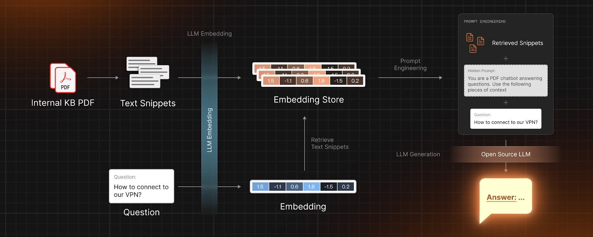

# Building a PDF Knowledge Bot with Open-source LLMs on Shakudo

## Solution Overview:
For any textual knowledge base (in our case, PDFs), we first need to extract text snippets from the knowledge base and use an embedding model to create a vector store representing the semantic content of the snippets. When a question is asked, we estimate its embedding and find relevant snippets using an efficient similarity search from vector stores. After extracting the snippets, we engineer a prompt and generate an answer using the LLM generation model. The prompt can be tuned based on the specific LLM used.

Experimentation and development are crucial elements in the field of data science. Shakudo's session facilitates the selection of the appropriate computing resources and provides the flexibility to choose Jupyter Notebooks, VS Code Server (provided by the platform) or connecting via SSH to use a preferred local editor.

* Jupyter notebook for tutorial : [pdf_qa](./pdf_qa.ipynb) 
* Associated blog tutorial: [Building a PDF Knowledge Bot With Open-Source LLMs- A Step-by-Step Guide
](https://www.shakudo.io/blog)

### Code References:
* The code is adapted based on the work in [LLM-WikipediaQA](https://github.com/georgesung/LLM-WikipediaQA/tree/main), where the author compares FastChat-T5, Flan-T5 with ChatGPT running a Q&A on Wikipedia Articles

