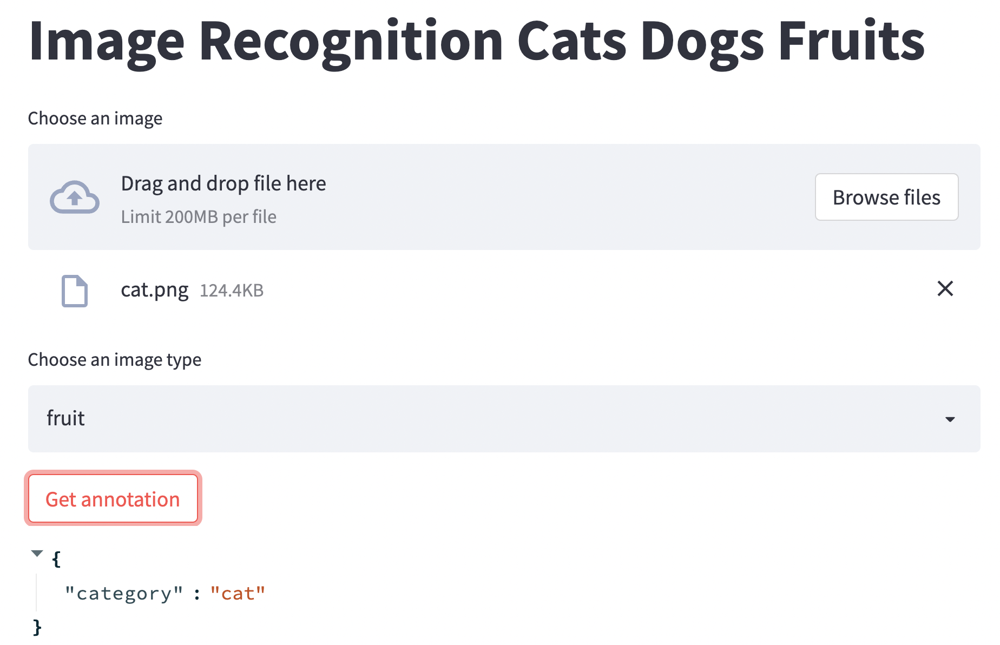

This is a skeleton App for building a streamlit frontend for a Hyperplane served model.   
## sample frontend   
<!--  -->

## How to use
- Streamlit can be used when you need to quickly expose a frontend for your Hyperplane service
- To get started, replace the dummy function in `sent_infer_request_in_cluster` in skexample.py with your real request function 
- Copy the image_recognition folder to your github repo (and change it to the name that makes sense to your App) 
- Go to the service tab on the Hyperplane dashboard and start a service with the `streamlit_pipelin.yaml' 
- Choose the service URL prefix for your Frontend App, this will be the URL of your frontend. Assume it's `my_awesome_frontend`
- After you hit the create button of the service and the service is up, you can then go to  `https://yourdomain.hyperplane.dev/my_awesome_frontend` to see the frontend 
- Streamlit has python APIs to build frontend components such as boxes, buttons, radio inputs and so on. [Read more about Streamlit](https://docs.streamlit.io/)
- Full documentation for streamlit please see the steamlit Documentation page. 
